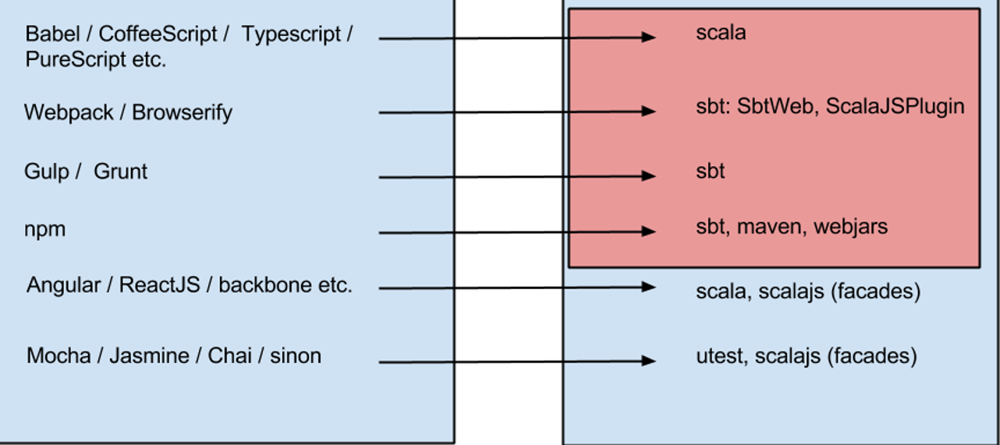
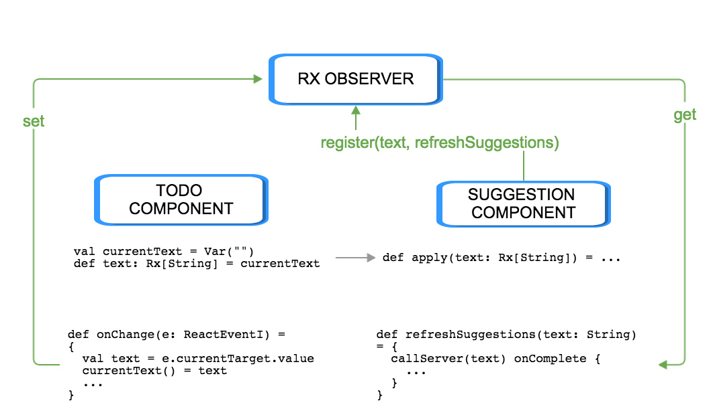

footer: © BoldRadius, 2015
slidenumbers: true

# SCALA J~~__AVA__~~S~~__CRIPT__~~

__Katrin Shechtman__
BoldRadius, Toronto, Canada

__Dave Sugden__
BoldRadius, Gatineau, Quebec


---

# [fit] How to convince your Manager* to adopt scalajs

__*Manager: boss | client | CTO | colleague | that clojurescript guy__   

* Effective front-end development with the scalajs ecosystem is viable (and preferable!).

* Here are some tools to enable you to persuade whoever you need to.


^ dave

---

# Who are you?

1. You know and love scala
2. You have to deal with some non-trivial web front-end 
2. You don't scalajs? Lets get you going.
3. You do scalajs? Here are some of our opinions

^ katrin

---


# Who are we?

* Server Side scala/akka developers
* Relatively new to scalajs  
* Have experience writing javascript for the front-end 

^ katrin

---

# [fit] Path to scalajs: shoulders of giants
### Part 1

Like many others, our path to scalajs began with *@lihaoyi*

* scalatags

```scala
form(
 div(cls := "form-group")(
   label(color := GlobalStyles.textColor)("Cluster Name"),
   input(tpe := "text", cls := "form-control", value := S.cluster.name, onChange ==> B.updateClusterName)
 )
)
```

^ dave

---

# [fit] Path to scalajs: shoulders of giants
### Part 2

* scalarx

```scala
import rx._
val a = Var(1)
val b = Var(2)
val c = Rx{ a() + b() }
println(c()) // 3
a() = 4
println(c()) // 6
```

^ dave

---


---

# Javascript, living the dream

* JS devs live and die by their setups*

* No different for scalajs... __you need a setup__

*setup: tooling, framework, module + dependency mgmt etc. 

^ katrin

---

# Javascript the language

__(from lihaoyi.github.io/hands-on-scala-js)__ 

* Its an OK language with some warts
* Not an easy language to work in at scale (refactoring)


^ dave

---

# Javascript as Platform

__(from lihaoyi.github.io/hands-on-scala-js)__

* No install
* Everywhere
* Sandboxed security

^ dave

---

# A Javascript "setup"


* Newcomers are often coming from communities in which full-stack solutions exist.

* JavaScript tooling often consists of small tools, utilities and libraries that combined builds your code to be used in a browser.

* Variety is *huge*

^ dave

---

# A Javascript "setup" - Part 1

 1. Babel / CoffeeScript /  Typescript /  PureScript: transpilers 
 2. Webpack / Browserify : module bundlers
 3. Gulp /  Grunt : build systems, task runners, orchestrate processes to work on some files

^ dave

---

# A Javascript "setup" - Part 2

 4. npm:  package manager, downloading packages, resolving dependencies
 5. Mocha / Jasmine / Chai / sinon: Test framework
 6. AngularJS / Ember / Backbone / React   etc.

^ dave

---


# A Scala "setup"

##[fit]You are already a scala expert and familiar with SBT:
  
##[fit]You already have 2/3 of your "setup"
 
^ katrin 
 
---
# Scala, SBT, ScalaJsPlugin, Webjars: the first 2/3...



---


#[fit]The Final Third of your Setup

* scalajs-dom, scalatags
* scalarx
* scalajs-react
* autowire
* upickle
* sbt tasks and plugins

^ katrin

---
# Scalajs really practical guide
### https://github.com/katrinsharp/scalajs-rpg
* __Anatomy__ of typical Scalajs app
* Each step contains __minimal__ code and dependencies
* Client assets are independent from server
* __Proposed__ architecture


^ katrin

---


# 1. MAKE SURE YOU SHARE!

### Server/client code sharing - done right
### addSbtPlugin("org.scala-js" % "sbt-scalajs" % "0.6.4")

```scala
//build.sbt
import org.scalajs.sbtplugin.ScalaJSPlugin.autoImport._
name := "scalajs-rpg"
lazy val root = project.in(file("."))
  .aggregate(jsProject, jvmProject)
lazy val cross = crossProject.in(file("."))
  .settings(
    name := "scalajs-rpg",
    version := "0.1-SNAPSHOT",
    scalaVersion := "2.11.7")
  .jvmSettings()// JVM-specific settings here
  .jsSettings()// JS-specific settings here
```

---

# 2. MANIPULATE THIS HTML DOM.

### And use your first Scalajs facade
### "org.scala-js" %%% "scalajs-dom" % "0.8.0"

```scala
val mainEl = dom.document.getElementById("main-el")
//option A
mainEl.innerHTML = s"""
       |<div>some stuff</div>
       ...
     """.stripMargin
//option B
val parNode = doc.createElement("p")
...
mainEl.appendChild(parNode)
```
---

# 3. GOT DEPENDENCIES? SBT IT!

### Use WebJars with sbt-web 
### [fit]addSbtPlugin("com.typesafe.sbt" % "sbt-web" % "1.1.1")

```scala
"org.webjars" % "jquery" % "1.11.1" / "jquery.js",
"org.webjars" % "bootstrap" % "3.3.2" / "bootstrap.js" dependsOn "jquery.js"
```
```html
<!-- dep in index-fastopt.html -->
<link rel="stylesheet" type="text/css" 
href="./js/target/web/web-modules/main/webjars/lib/bootstrap/css/bootstrap.min.css">
```

---

# 4. SAFE HTML EDUCATION.

### With scalatags (scalacss? out-of-scope this time)
### "com.lihaoyi" %%% "scalatags" % "0.5.2"

```scala
divInMainEl.appendChild(
	div(`class` := "col-md-8", 
		p(`class` := "red", s"From shared and type safe: $res")
	).render
)
```

---

# 5. DON'T RE-INVENT THE WHEEL!

### jQuery, Angular, React, (Ionic, Electron) ...
## [fit] "com.github.japgolly.scalajs-react" %%% "core" % "0.9.0"

```scala
val component = ReactComponentB[Unit]("TodoListComponent")
  .initialState(State(List.empty[Todo], ""))
  .backend(new Backend(_))
  .render((_, S, B) =>
	div(
	  h3("TODO"),
	  TodoList(S.items),
	  form(onSubmit ==> B.handleSubmit,
	    input(onChange ==> B.onChange, value := S.text),
	    button("Add")
	  )
	)
  ).buildU      
```

---

# 6. KEEP YOUR DATA IN SYNC!

### "com.lihaoyi" %%% "scalarx" % "0.2.8"



---

# [fit] 7. TREAT YOUR AJAX CALLS WITH SOME SAFETY!

### "com.lihaoyi" %%% "autowire" % "0.2.5"

```scala
//SHARED
trait Api {
  def suggestions(s: String): Seq[Suggestion]
}
//SERVER: segments: 
val req = autowire.Core.Request(segments, params)
AutowireServer.route[Api](ApiImpl)(req)
/* CLIENT:
** 1. Call statically typed API
** 2. Implement callback that will be called when your Future completes
** 3. Use Rx to automatically update the client state
*/
AjaxClient[Api].suggestions(text).call().foreach(r => currentSuggestions() = r)
```

---

# [fit] 8. RELEASE YOUR CLIENT TO THE WILD. RAWWRR....

* IF your assets are hosted somewhere else:

```scala
lazy val ReleaseJsCmd = Command.command("releaseJs") {
  state =>
    "crossJS/fullOptJS" ::
    "crossJS/webStage" ::
    state
}
...
jsSettings(
    pipelineStages := Seq(cssCompress),
    commands += ReleaseJsCmd
  )
```

* IF you host assets on your app server - package it 

---

#[fit]Now you have a setup, whats next?

The real (fun) work begins...

You need to show your __prospect__ that this works.

^ dave

---

#[fit]You could...

* Find an internal project that requires a UI
  * Something your people care about.
  * Interactive visual representation of your best stuff.

* Remove all the friction associated with scalajs
  * Own the problems

^ dave

---
#Tips

* Console / dashboard all the things.
* Use websockets and make that server push 
* Use a dark background


---
#[fit]Our experiment with akka cluster

###A distributed application with akka cluster presents an opportunity:
* What are the states of my clustered actors?
* What are the dependencies between them?
* What hardware are they on?


^ dave

---

#cluster-console

* Subscribe to any cluster's events
* Push events to UI with websockets + akka-http streams
* Safe client-server API with autowire + akka-http
* scalajs-react for ui components
* data binding with scalarx

---
# Acknowledgements

@lihaoyi


* scalajs-react:  David Barri @japgolly

* scalajs-spa-tutorial Otto Chrons @ochrons


^ dave

---
#Highlights

### d3 facade

```scala
package Layout {
  trait Layout extends js.Object {
    def force(): ForceLayout = js.native
  }
  trait ForceLayout extends js.Function {
    def size(mysize: js.Array[Double]): ForceLayout = js.native
    def charge(number: Double): ForceLayout = js.native
    def linkDistance(number: Double): ForceLayout = js.native
    def friction(number: Double): ForceLayout = js.native
  }
}
val force = d3.layout.force()
.size(List[Double](P.width, P.height).toJsArray)
.charge(-1500)
.linkDistance(1000)
.friction(0.9)
```

---
#Highlights

### d3 inside scalajs-react

```scala
 val component = ReactComponentB[Props]("Graph").initialStateP { P =>
      val force = ...
      val (nodes, links) = // calculate Seq[GraphNode], Seq[GraphLink]
      State(nodes, links, force)
    }.backend(new Backend(_))
    .render{(P, S, B) => 
      svgtag(SvgAttrs.width := P.width, SvgAttrs.height := P.height)(
        drawLinks(S.links, P.mode),
        drawNodes(S.nodes, S.force, P.mode)
      )
    }.componentWillMount { scope => scope.backend.startfixed()}.build
```
---

#Highlights

###Back to arguing about more important things:


```scala

    indexes.flatMap(index => 
        indexes.filter(_ > index).map((index, _)))
```
vs

```scala
    for {
      index <- indexes
      eachOther <- indexes.filter(_ > index)
      tuple <- Some(index, eachOther)
    } yield tuple
```
---


# Demo

##[fit]https://github.com/dsugden/cluster-console

^ dave


